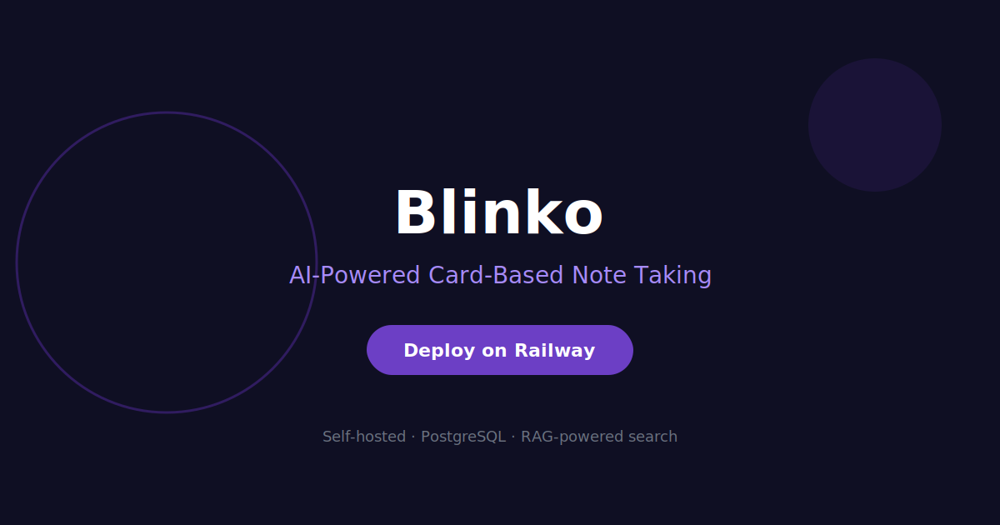

# Deploy and Host

[](https://railway.app/template/blinko)

> **Canonical code:** `blinko` — deploy URL: https://railway.app/template/blinko



Blinko is an AI-powered, card-based note-taking app with RAG (Retrieval-Augmented Generation). Capture ideas, chat with your notes, and let AI help you connect thoughts — all self-hosted on Railway.

## About Hosting

Blinko runs as a single container with a Railway-managed PostgreSQL database. Railway provides the compute, TLS at the edge, and a public URL. The service restarts automatically on failures. All notes and AI embeddings are stored in PostgreSQL — no persistent volume required.

## Why Deploy

- **AI-native notes** — Chat with your knowledge base using RAG. Ask questions and Blinko retrieves relevant notes with AI context.
- **Card-based UI** — Organize thoughts visually with a modern card interface instead of folders.
- **17K+ GitHub stars** — One of the fastest-growing open-source AI knowledge tools.
- **Managed PostgreSQL** — Railway provisions your database with auto-injected connection strings.
- **Single container** — No sidecars, no vector database, no external services beyond Postgres.

## Common Use Cases

- **Personal knowledge base** — Capture ideas, research, and notes then chat with them via AI.
- **Study & learning** — Take notes on topics and ask Blinko to explain connections between concepts.
- **Meeting notes** — Record meeting insights and query them later with natural language.
- **Research assistant** — Store papers, articles, and references then ask AI to synthesize findings.
- **Second brain** — Build a searchable, AI-augmented personal wiki.

## Dependencies for Blinko

### Deployment Dependencies

Blinko requires a PostgreSQL database. Add a Railway PostgreSQL service to your project — the connection string is auto-injected via `DATABASE_URL`. No vector database or additional services needed.

---

## Features

- AI-powered RAG note search — chat with your notes
- Card-based visual organization
- PostgreSQL backend for all data and embeddings
- Pinned Docker image (v1.8.8)
- One-click deploy with auto-configured database

## Quick Start

1. Click **Deploy on Railway** above
2. Add a **PostgreSQL** service
3. Set `NEXTAUTH_SECRET` to a random string
4. Deploy — Blinko starts in ~60s
5. Open your Railway URL to start capturing ideas

## Environment Variables

| Variable | Required | Default | Description |
|----------|----------|---------|-------------|
| `DATABASE_URL` | Yes | Auto | PostgreSQL connection (Railway auto-injects) |
| `NEXTAUTH_SECRET` | Yes | — | Random secret for auth encryption |
| `NEXTAUTH_URL` | Yes | — | Public URL of your instance |
| `PORT` | No | `1111` | Container port (Railway auto-sets) |

## Local Development

```bash
git clone https://github.com/INAPP-Mobile/railway-blinko && cd railway-blinko
cp .env.example .env && $EDITOR .env
docker build -t railway-blinko .
docker run -d -p 1111:1111 --env-file .env railway-blinko
```

## Troubleshooting

| Issue | Solution |
|-------|----------|
| Database connection failed | Verify `DATABASE_URL` is set and Postgres is running |
| Login not working | Ensure `NEXTAUTH_SECRET` is set and `NEXTAUTH_URL` matches your Railway domain |
| AI features not working | Check Blinko docs for AI provider configuration |

## License

Blinko is AGPL-3.0 licensed. Template by [INAPP-Mobile](https://github.com/INAPP-Mobile).
